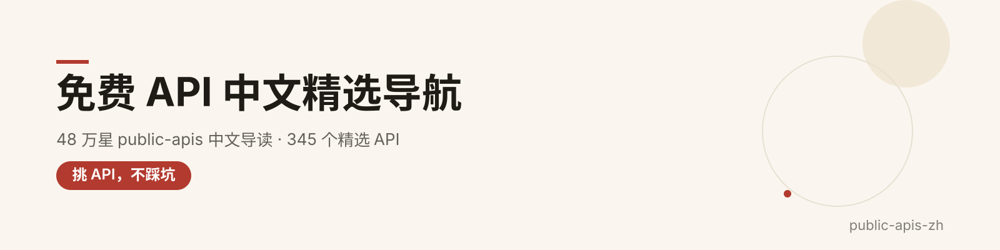
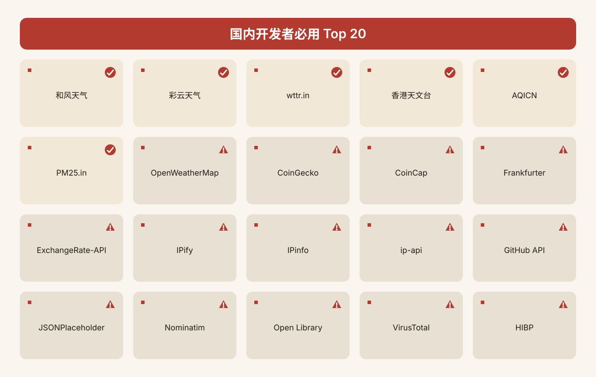
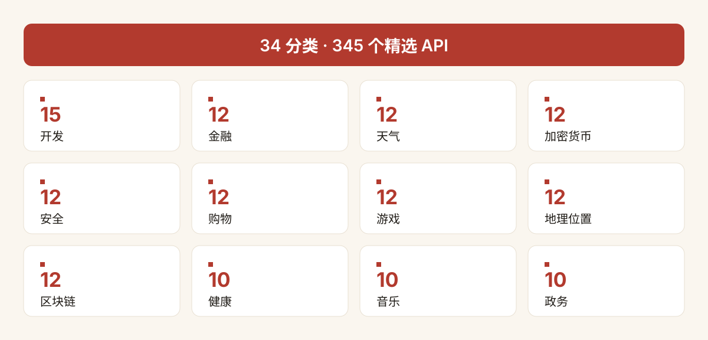

  

<h1 align="center">public-apis-zh</h1>

> **48 万 star 的「免费 API 大全」，终于有中文精选版了。**
>
> 从 GitHub 顶流仓库 [public-apis/public-apis](https://github.com/public-apis/public-apis)（MIT，48.5 万 star，收录 1959 个免费 API）中，精选 **345 个中文用户真正用得上**的 API，每个标注**国内可访问性**——不再凭运气试接口，一眼看出哪个能直连、哪个要代理、哪个别碰。

---

## ✨ 为什么值得收藏

- **345 个精选 API / 34 个分类**：按原仓库分类结构整理，中文分类名一目了然；
- **国内可访问性标注**：✅ 可直接访问 / ⚠️ 需代理或时好时坏 / ❌ 国内不可用，每个接口都标清楚；
- **字段齐全**：中文名称 + 一句话说明 + 鉴权方式 + HTTPS + CORS + 官网链接，选型三分钟搞定；
- **Top 20 刚需速览**：天气、空气质量、币价、汇率、IP 查询、GitHub、图库……高频刚需一次收齐；
- **全部免费用得起**：优先收录免密钥（Auth=无）与免费额度充足的接口，开源项目友好。

> ⚠️ **可访问性说明**：✅/⚠️/❌ 标注基于 2026-10 一般网络环境的普遍认知，仅供选型参考，实际情况可能随网络环境与时间变化。

---

## 🚀 国内开发者必用 Top 20

来不及全看？先收藏这 20 个高频刚需：

| # | API | 一句话用途 | 分类 | 国内可访问 | 官网 |
| --- | --- | --- | --- | --- | --- |
| 1 | **和风天气** | 实时天气 / 逐小时 / 15 天预报 | 天气 | ✅ 可直接访问 | [官网](https://dev.qweather.com/) |
| 2 | **彩云天气** | 分钟级降水预报，国产免费 | 天气 | ✅ 可直接访问 | [官网](https://open.caiyunapp.com/ColorfulClouds_Weather_API) |
| 3 | **wttr.in** | 一条 URL 返回终端天气文本 | 天气 | ✅ 可直接访问 | [官网](https://wttr.in/:help) |
| 4 | **香港天文台** | 香港实时天气与预报开放数据 | 天气 | ✅ 可直接访问 | [官网](https://www.hko.gov.hk/en/abouthko/opendata_intro.htm) |
| 5 | **AQICN** | 全球 1000+ 城市空气质量指数 | 天气 / 环境 | ✅ 可直接访问 | [官网](https://aqicn.org/api/) |
| 6 | **PM25.in** | 国内城市 PM2.5 老牌公益接口 | 环境 | ✅ 可直接访问 | [官网](http://www.pm25.in/api_doc) |
| 7 | **OpenWeatherMap** | 全球最流行的天气数据 API | 天气 | ⚠️ 需代理或时好时坏 | [官网](https://openweathermap.org/api) |
| 8 | **CoinGecko** | 免密钥币价与市值，上万币种 | 加密货币 | ⚠️ 需代理或时好时坏 | [官网](http://www.coingecko.com/api) |
| 9 | **CoinCap** | 免密钥实时币价 REST 接口 | 加密货币 | ⚠️ 需代理或时好时坏 | [官网](https://docs.coincap.io/) |
| 10 | **Frankfurter** | 欧洲央行汇率，免费无密钥 | 货币 | ⚠️ 需代理或时好时坏 | [官网](https://www.frankfurter.app/docs) |
| 11 | **ExchangeRate-API** | 160+ 币种实时换算 | 货币 | ⚠️ 需代理或时好时坏 | [官网](https://www.exchangerate-api.com) |
| 12 | **IPify** | 极简公网 IP 查询，免密钥 | 开发 | ⚠️ 需代理或时好时坏 | [官网](https://www.ipify.org/) |
| 13 | **IPinfo** | IP 地理位置 / 城市 / ASN 查询 | 开发 | ⚠️ 需代理或时好时坏 | [官网](https://ipinfo.io/developers) |
| 14 | **ip-api.com** | 经典 IP 归属地查询 | 地理位置 | ⚠️ 需代理或时好时坏 | [官网](https://ip-api.com/docs) |
| 15 | **GitHub API** | 仓库 / 代码 / 用户信息编程访问 | 开发 | ⚠️ 需代理或时好时坏 | [官网](https://docs.github.com/en/free-pro-team@latest/rest) |
| 16 | **JSONPlaceholder** | 假 REST API，原型与测试利器 | 开发 | ⚠️ 需代理或时好时坏 | [官网](https://jsonplaceholder.typicode.com) |
| 17 | **Nominatim** | OpenStreetMap 全球地理编码 | 地理位置 | ⚠️ 需代理或时好时坏 | [官网](https://nominatim.org/release-docs/latest/api/Overview/) |
| 18 | **Open Library** | 开放书目与图书封面数据库 | 书籍 | ⚠️ 需代理或时好时坏 | [官网](https://openlibrary.org/developers/api) |
| 19 | **VirusTotal** | 数十款杀软聚合扫描 | 反病毒 | ⚠️ 需代理或时好时坏 | [官网](https://docs.virustotal.com/reference/overview) |
| 20 | **Have I Been Pwned** | 查询邮箱密码是否泄露 | 安全 | ⚠️ 需代理或时好时坏 | [官网](https://haveibeenpwned.com/API/v3) |

  

> 说明：本表只收录本精选范围内的 API；原仓库未设「翻译 / OCR / 短信 / 快递」等独立分类，故未纳入，欢迎在 `categories/` 下提 PR 补充。

---

## 🗂 分类总览

| # | 分类 | 条数 | # | 分类 | 条数 |
| --- | --- | --- | --- | --- | --- |
| 1. 动物 | 10 | 18. 餐饮 | 8 |
| 2. 动漫 | 10 | 19. 游戏 | 12 |
| 3. 反病毒 | 5 | 20. 地理位置 | 12 |
| 4. 艺术与设计 | 10 | 21. 政务 | 10 |
| 5. 认证与授权 | 7 | 22. 健康 | 10 |
| 6. 区块链 | 12 | 23. 音乐 | 10 |
| 7. 书籍 | 10 | 24. 新闻 | 10 |
| 8. 商业 | 12 | 25. 开放数据 | 12 |
| 9. 日历 | 8 | 26. 专利 | 4 |
| 10. 云存储与文件 | 10 | 27. 照片 | 10 |
| 11. 货币 | 10 | 28. 科学 | 10 |
| 12. 加密货币 | 12 | 29. 安全 | 12 |
| 13. 数据验证 | 10 | 30. 购物 | 12 |
| 14. 开发 | 15 | 31. 社交 | 10 |
| 15. 字典 | 8 | 32. 体育 | 10 |
| 16. 环境 | 10 | 33. 交通 | 10 |
| 17. 金融 | 12 | 34. 天气 | 12 |

| **合计** | **34 个分类** | **345 个精选 API** |  |  |  |

  

---

## 📖 字段图例

- **鉴权**：`无`（免密钥直接用）· `API Key`（官网注册拿 key）· `OAuth`（授权流程）· `UA`（User-Agent 即可）；
- **HTTPS**：✅ 支持 / ❌ 不支持；**CORS**：✅ 支持 / ❌ 不支持 / `未知`（未声明）；
- **国内可访问**：✅ 可直接访问 / ⚠️ 需代理或时好时坏 / ❌ 国内不可用（标注为普遍认知，供参考）。

---

# 分类正文

## 1. 动物（10 个）

> 从猫狗卖萌到鸟类迁徙与 IUCN 红色名录，动物主题免费 API 一次收齐。

| 中文名称 | 一句话说明 | 鉴权 | HTTPS | CORS | 国内可访问 | 官网 |
| --- | --- | --- | --- | --- | --- | --- |
| The Cat API | 海量猫咪图片与品种数据，萌宠类应用常用素材源 | API Key | ✅ | ❌ | ⚠️ 需代理或时好时坏 | [官网](https://docs.thecatapi.com/) |
| Dog API（dog.ceo） | 基于斯坦福犬类数据集的随机狗狗图片接口，免密钥 | 无 | ✅ | ✅ | ⚠️ 需代理或时好时坏 | [官网](https://dog.ceo/dog-api/) |
| HTTP Cat | 每个 HTTP 状态码配一张猫图，调试报错时的经典梗 | 无 | ✅ | ✅ | ⚠️ 需代理或时好时坏 | [官网](https://http.cat/) |
| eBird 观鸟记录 | 康奈尔鸟类学实验室的区域近期观鸟观测数据 | API Key | ✅ | ❌ | ⚠️ 需代理或时好时坏 | [官网](https://documenter.getpostman.com/view/664302/S1ENwy59) |
| IUCN 红色名录 | 全球濒危物种官方名录与保护现状查询 | API Key | ✅ | ❌ | ⚠️ 需代理或时好时坏 | [官网](https://www.iucnredlist.org/en) |
| xeno-canto | 全球鸟类鸣叫声录音库，可按物种检索与下载 | 无 | ✅ | 未知 | ⚠️ 需代理或时好时坏 | [官网](https://xeno-canto.org/explore/api) |
| FishWatch 鱼类图鉴 | 美国官方鱼类物种介绍与高清图片资料 | 无 | ✅ | ✅ | ⚠️ 需代理或时好时坏 | [官网](https://www.fishwatch.gov/developers) |
| RandomFox | 随机返回一张可爱狐狸照片，适合做壁纸或解压 | 无 | ✅ | ❌ | ⚠️ 需代理或时好时坏 | [官网](https://randomfox.ca/floof/) |
| Movebank 动物迁徙 | 全球动物运动与迁徙轨迹的科研数据平台 | 无 | ✅ | ✅ | ⚠️ 需代理或时好时坏 | [官网](https://github.com/movebank/movebank-api-doc) |
| Cat Facts | 随机返回一条猫咪冷知识科普，接口极简免密钥 | 无 | ✅ | ✅ | ⚠️ 需代理或时好时坏 | [官网](https://catfact.ninja/) |

## 2. 动漫（10 个）

> 番剧数据库、截图找番到吉卜力资料，二次元开发者必备清单。

| 中文名称 | 一句话说明 | 鉴权 | HTTPS | CORS | 国内可访问 | 官网 |
| --- | --- | --- | --- | --- | --- | --- |
| Jikan | 非官方 MyAnimeList 接口，番剧评分排行数据齐全 | 无 | ✅ | ✅ | ⚠️ 需代理或时好时坏 | [官网](https://jikan.moe) |
| AniList | 热门追番社区，GraphQL 接口灵活获取番剧数据 | OAuth | ✅ | 未知 | ⚠️ 需代理或时好时坏 | [官网](https://github.com/AniList/ApiV2-GraphQL-Docs) |
| MyAnimeList | 全球最大动漫评分社区官方 API | OAuth | ✅ | 未知 | ⚠️ 需代理或时好时坏 | [官网](https://myanimelist.net/clubs.php?cid=13727) |
| MangaDex | 开源漫画社区的章节、元数据与封面接口 | API Key | ✅ | 未知 | ⚠️ 需代理或时好时坏 | [官网](https://api.mangadex.org/docs.html) |
| Studio Ghibli | 吉卜力工作室电影、角色与场景资料库 | 无 | ✅ | ✅ | ⚠️ 需代理或时好时坏 | [官网](https://ghibliapi.vercel.app) |
| trace.moe | 上传动画截图即可反查出处、作品与时间戳 | 无 | ✅ | ✅ | ⚠️ 需代理或时好时坏 | [官网](https://soruly.github.io/trace.moe-api/#/) |
| Anime News Network | 动漫行业新闻与百科全书的开放数据接口 | 无 | ✅ | ✅ | ⚠️ 需代理或时好时坏 | [官网](https://www.animenewsnetwork.com/encyclopedia/api.php) |
| Kitsu | 动漫发现与追番社区，支持 OAuth 接入 | OAuth | ✅ | ✅ | ⚠️ 需代理或时好时坏 | [官网](https://kitsu.docs.apiary.io/) |
| AnimeChan | 收录一万多条经典动漫台词语录 | 无 | ✅ | ❌ | ⚠️ 需代理或时好时坏 | [官网](https://github.com/RocktimSaikia/anime-chan) |
| Nekos.best | 随机猫娘图片与动漫角色扮演 GIF 素材 | 无 | ✅ | ✅ | ⚠️ 需代理或时好时坏 | [官网](https://docs.nekos.best) |

## 3. 反病毒（5 个）

> 安全团队常用的威胁情报库与文件、URL 沙箱检测接口。

| 中文名称 | 一句话说明 | 鉴权 | HTTPS | CORS | 国内可访问 | 官网 |
| --- | --- | --- | --- | --- | --- | --- | --- |
| VirusTotal | 老牌多引擎文件与 URL 扫描平台，一次调用聚合数十款杀软结果 | API Key | ✅ | 未知 | ⚠️ 需代理或时好时坏 | [官网](https://docs.virustotal.com/reference/overview) |
| URLScan.io | 在隔离浏览器中抓取分析 URL，留存页面截图与全部网络请求 | API Key | ✅ | 未知 | ⚠️ 需代理或时好时坏 | [官网](https://urlscan.io/about-api/) |
| AbuseIPDB | 社区共建的 IP、域名、URL 信誉库，可查黑名单也可举报恶意地址 | API Key | ✅ | 未知 | ⚠️ 需代理或时好时坏 | [官网](https://docs.abuseipdb.com/) |
| MalwareBazaar | abuse.ch 旗下恶意软件样本收集与共享平台，供安全研究下载样本 | API Key | ✅ | 未知 | ⚠️ 需代理或时好时坏 | [官网](https://bazaar.abuse.ch/api/) |
| Google Safe Browsing | Google 提供的恶意站点与钓鱼链接数据库，浏览器级防护同款 | API Key | ✅ | 未知 | ❌ 国内不可用 | [官网](https://developers.google.com/safe-browsing/) |

## 4. 艺术与设计（10 个）

> 图标、配色、占位图到博物馆开放数据，设计师与前端都用得上。

| 中文名称 | 一句话说明 | 鉴权 | HTTPS | CORS | 国内可访问 | 官网 |
| --- | --- | --- | --- | --- | --- | --- |
| Iconify | 聚合 200+ 开源图标库，一处检索 SVG 图标 | 无 | ✅ | ✅ | ⚠️ 需代理或时好时坏 | [官网](https://iconify.design/docs/api/) |
| Icons8 | 老牌图标素材库，按风格与场景检索图标 | 无 | ✅ | 未知 | ⚠️ 需代理或时好时坏 | [官网](https://img.icons8.com/) |
| The Color API | 颜色格式转换与配色方案生成工具接口 | 无 | ✅ | ✅ | ⚠️ 需代理或时好时坏 | [官网](https://www.thecolorapi.com) |
| DummyImage | 自定义尺寸、颜色与文字的占位图生成服务 | 无 | ✅ | 未知 | ⚠️ 需代理或时好时坏 | [官网](https://dummyimage.com/) |
| Dribbble | 全球设计师作品社区，可发现创意与灵感 | OAuth | ✅ | 未知 | ⚠️ 需代理或时好时坏 | [官网](https://developer.dribbble.com) |
| 芝加哥艺术学院 | 博物馆开放藏品数据与高清艺术品图片 | 无 | ✅ | ✅ | ⚠️ 需代理或时好时坏 | [官网](https://api.artic.edu/docs/) |
| 大都会艺术博物馆 | Met 馆藏开放数据，覆盖海量名画与文物 | 无 | ✅ | ❌ | ⚠️ 需代理或时好时坏 | [官网](https://metmuseum.github.io/) |
| EmojiHub | 按分类与分组检索表情符号元数据 | 无 | ✅ | ✅ | ⚠️ 需代理或时好时坏 | [官网](https://github.com/cheatsnake/emojihub) |
| Icon Horse | 输入任意网址即可取回该站点 favicon | 无 | ✅ | ✅ | ⚠️ 需代理或时好时坏 | [官网](https://icon.horse) |
| Europeana | 欧洲博物馆与画廊的数字文化遗产聚合检索 | API Key | ✅ | 未知 | ⚠️ 需代理或时好时坏 | [官网](https://pro.europeana.eu/resources/apis/search) |

## 5. 认证与授权（7 个）

> 登录注册、无密码认证与权限控制的一站式基础设施。

| 中文名称 | 一句话说明 | 鉴权 | HTTPS | CORS | 国内可访问 | 官网 |
| --- | --- | --- | --- | --- | --- | --- |
| Auth0 | 主流身份认证云平台，支持社交登录与多租户 | API Key | ✅ | ✅ | ⚠️ 需代理或时好时坏 | [官网](https://auth0.com) |
| GetOTP | 快速接入一次性验证码 OTP 发送与校验流程 | API Key | ✅ | ❌ | ⚠️ 需代理或时好时坏 | [官网](https://otp.dev/en/docs/) |
| Micro User Service | 轻量级用户管理与认证微服务 | API Key | ✅ | ❌ | ⚠️ 需代理或时好时坏 | [官网](https://m3o.com/user) |
| MojoAuth | 面向现代应用的安全无密码认证平台 | API Key | ✅ | ✅ | ⚠️ 需代理或时好时坏 | [官网](https://mojoauth.com) |
| SAWO Labs | 无密码登录方案，提升 App 注册与登录转化 | API Key | ✅ | ✅ | ⚠️ 需代理或时好时坏 | [官网](https://sawolabs.com) |
| Stytch | 为现代应用打造的用户身份基础设施 | API Key | ✅ | ❌ | ⚠️ 需代理或时好时坏 | [官网](https://stytch.com/) |
| Warrant | 授权与访问控制（RBAC）专用 API | API Key | ✅ | ✅ | ⚠️ 需代理或时好时坏 | [官网](https://warrant.dev/) |

## 6. 区块链（12 个）

> 链上数据查询、区块浏览与 RPC 节点服务，Web3 开发的基础设施。

| 中文名称 | 一句话说明 | 鉴权 | HTTPS | CORS | 国内可访问 | 官网 |
| --- | --- | --- | --- | --- | --- | --- |
| Etherscan | 以太坊最主流的区块浏览器，查地址、交易与合约的标配接口 | API Key | ✅ | ✅ | ⚠️ 需代理或时好时坏 | [官网](https://etherscan.io/apis) |
| The Graph | 为以太坊等网络建索引，用 GraphQL 高效查询链上数据 | API Key | ✅ | 未知 | ⚠️ 需代理或时好时坏 | [官网](https://thegraph.com) |
| Chainlink | 去中心化预言机网络，给智能合约接入外部数据与可验证随机数 | 无 | ✅ | 未知 | ⚠️ 需代理或时好时坏 | [官网](https://chain.link/developer-resources) |
| Blockscout | 开源多链区块浏览器 REST API，调用方式兼容 Etherscan | API Key | ✅ | ❌ | ⚠️ 需代理或时好时坏 | [官网](https://dev.blockscout.com/) |
| Covalent | 多区块链数据聚合平台，用统一 API 取余额、代币与历史交易 | API Key | ✅ | 未知 | ⚠️ 需代理或时好时坏 | [官网](https://www.covalenthq.com/docs/api/) |
| Bitquery | 链上 GraphQL 与 DEX 数据接口，适合做行情与资金流向分析 | API Key | ✅ | ✅ | ⚠️ 需代理或时好时坏 | [官网](https://graphql.bitquery.io/ide) |
| Nownodes | 区块链即服务，一个密钥接入多条公链的节点 RPC | API Key | ✅ | 未知 | ⚠️ 需代理或时好时坏 | [官网](https://nownodes.io/) |
| SwiftNodes | 覆盖 80+ 网络的多链 RPC 节点，含以太坊、Solana 等 | API Key | ✅ | ✅ | ⚠️ 需代理或时好时坏 | [官网](https://swiftnodes.io) |
| Helium | 分布式无线热点网络，用区块链结算覆盖热点节点的收益 | 无 | ✅ | 未知 | ⚠️ 需代理或时好时坏 | [官网](https://docs.helium.com/api/blockchain/introduction/) |
| Chainpoint | 把任意数据锚定到比特币链上，生成可验证的时间戳证明 | 无 | ✅ | 未知 | ⚠️ 需代理或时好时坏 | [官网](https://tierion.com/chainpoint/) |
| Watchdata | 提供简单可靠的以太坊区块链 API 访问，免去自建节点运维 | API Key | ✅ | 未知 | ⚠️ 需代理或时好时坏 | [官网](https://docs.watchdata.io) |
| ClearTrace | 跨前端的 DEX 归因与执行质量数据，覆盖以太坊与各 L2 | 无 | ✅ | ✅ | ⚠️ 需代理或时好时坏 | [官网](https://cleartracedata.com/docs) |

## 7. 书籍（10 个）

> 从开放书目到宗教经典与诗歌，书籍文献类免费接口汇总。

| 中文名称 | 一句话说明 | 鉴权 | HTTPS | CORS | 国内可访问 | 官网 |
| --- | --- | --- | --- | --- | --- | --- |
| Open Library | 互联网档案馆发起的开放书目与封面数据库 | 无 | ✅ | ❌ | ⚠️ 需代理或时好时坏 | [官网](https://openlibrary.org/developers/api) |
| Google Books | Google 图书搜索与全文检索开发者接口 | OAuth | ✅ | 未知 | ❌ 国内不可用 | [官网](https://developers.google.com/books/) |
| Gutendex | 古腾堡计划公共领域电子书的元数据接口 | 无 | ✅ | 未知 | ⚠️ 需代理或时好时坏 | [官网](https://gutendex.com/) |
| Crossref Metadata | 学术图书与期刊文献元数据检索服务 | 无 | ✅ | 未知 | ⚠️ 需代理或时好时坏 | [官网](https://github.com/CrossRef/rest-api-doc) |
| PoetryDB | 英文诗歌全文数据库，可按诗人与篇目检索 | 无 | ✅ | ✅ | ⚠️ 需代理或时好时坏 | [官网](https://github.com/thundercomb/poetrydb#readme) |
| Bible-api | 免费多语言圣经经文查询接口，免密钥 | 无 | ✅ | ✅ | ⚠️ 需代理或时好时坏 | [官网](https://bible-api.com/) |
| Quran Cloud | 古兰经章节、经文与诵读音频的 REST 接口 | 无 | ✅ | ✅ | ⚠️ 需代理或时好时坏 | [官网](https://alquran.cloud/api) |
| Wizard World | 哈利波特魔法世界的角色、咒语与道具数据 | 无 | ✅ | ✅ | ⚠️ 需代理或时好时坏 | [官网](https://wizard-world-api.herokuapp.com/swagger/index.html) |
| Penguin Random House | 企鹅兰登书屋官方书目与封面资料接口 | 无 | ✅ | ✅ | ⚠️ 需代理或时好时坏 | [官网](http://www.penguinrandomhouse.biz/webservices/rest/) |
| Bhagavad Gita API | 薄伽梵歌多语言译本与注释查询接口 | API Key | ✅ | ✅ | ⚠️ 需代理或时好时坏 | [官网](https://docs.bhagavadgitaapi.in) |

## 8. 商业（12 个）

> 从公司信息到项目管理，商业开发常用 API 一览。

| 中文名称 | 一句话说明 | 鉴权 | HTTPS | CORS | 国内可访问 | 官网 |
| --- | --- --- | --- | --- | --- |
| Apache Superset | 开源 BI 平台，可编程管理仪表盘与数据源 | API Key | ✅ | ✅ | ⚠️ 需代理或时好时坏 | [官网](https://superset.apache.org/docs/api) |
| Clearbit Logo | 按域名查询公司 Logo，可直接嵌入项目 | API Key | ✅ | 未知 | ⚠️ 需代理或时好时坏 | [官网](https://clearbit.com/docs#logo-api) |
| Domainsdb.info | 已注册域名搜索，按关键词查所有相关域名 | 无 | ✅ | ❌ | ⚠️ 需代理或时好时坏 | [官网](https://domainsdb.info/) |
| Freelancer | 全球自由职业者平台，支持按项目找人外包 | OAuth | ✅ | 未知 | ⚠️ 需代理或时好时坏 | [官网](https://developers.freelancer.com) |
| Mailchimp | 知名邮件营销平台，发送推广与事务性邮件 | API Key | ✅ | 未知 | ⚠️ 需代理或时好时坏 | [官网](https://mailchimp.com/developer/) |
| Redash | 开源数据可视化平台，通过 API 查询仪表盘 | API Key | ✅ | ✅ | ⚠️ 需代理或时好时坏 | [官网](https://redash.io/help/user-guide/integrations-and-api/api) |
| Smartsheet | 类表格项目管理工具，可编程访问数据 | OAuth | ✅ | ❌ | ⚠️ 需代理或时好时坏 | [官网](https://smartsheet.redoc.ly/) |
| Square | 知名支付平台，收款、退款与在线结账 | OAuth | ✅ | 未知 | ⚠️ 需代理或时好时坏 | [官网](https://developer.squareup.com/reference/square) |
| Trello | 看板式项目管理，列表与卡片组织任务 | OAuth | ✅ | 未知 | ⚠️ 需代理或时好时坏 | [官网](https://developers.trello.com/) |
| Tomba | B2B 邮箱查找与验证，助力销售与营销 | API Key | ✅ | ✅ | ⚠️ 需代理或时好时坏 | [官网](https://tomba.io/api) |
| Instatus | 状态页管理，通过 API 发布维护与故障通知 | API Key | ✅ | 未知 | ⚠️ 需代理或时好时坏 | [官网](https://instatus.com/help/api) |
| KontragentPro | 俄罗斯企业数据查询，按 INN 查公司档案 | 无 | ✅ | ✅ | ⚠️ 需代理或时好时坏 | [官网](https://kontragentpro.ru/api/v2/docs) |

## 9. 日历（8 个）

> 节假日查询与日历管理，做排期提醒应用必备。

| 中文名称 | 一句话说明 | 鉴权 | HTTPS | CORS | 国内可访问 | 官网 |
| --- | --- --- | --- | --- | --- |
| caldays | 覆盖 195+ 国家的公共节假日数据，免费免密钥 | 无 | ✅ | ✅ | ⚠️ 需代理或时好时坏 | [官网](https://caldays.com/api) |
| Calendarific | 全球节假日 API，支持多国家多类型查询 | API Key | ✅ | 未知 | ⚠️ 需代理或时好时坏 | [官网](https://calendarific.com/) |
| Google Calendar | 谷歌日历，可编程创建与管理日程事件 | OAuth | ✅ | 未知 | ❌ 国内不可用 | [官网](https://developers.google.com/google-apps/calendar/) |
| Nager.Date | 90+ 国家公共节假日查询，开源免费 | 无 | ✅ | ❌ | ⚠️ 需代理或时好时坏 | [官网](https://date.nager.at) |
| HolidayAPI | 历史节假日数据查询，支持多国多地区 | API Key | ✅ | 未知 | ⚠️ 需代理或时好时坏 | [官网](https://holidayapi.com/) |
| UK Bank Holidays | 英国官方银行假日数据，政府公开 JSON | 无 | ✅ | 未知 | ⚠️ 需代理或时好时坏 | [官网](https://www.gov.uk/bank-holidays.json) |
| The Calendar | 美国各州与 30 国节假日，含体育与财经日历 | 无 | ✅ | ✅ | ⚠️ 需代理或时好时坏 | [官网](https://the-calendar.net/api/) |
| Hebrew Calendar | 公历与希伯来历互转，查询安息日与节日时间 | 无 | ❌ | 未知 | ⚠️ 需代理或时好时坏 | [官网](https://www.hebcal.com/home/developer-apis) |

## 10. 云存储与文件（10 个）

> 从网盘到临时文件分享，开发者常用存储 API。

| 中文名称 | 一句话说明 | 鉴权 | HTTPS | CORS | 国内可访问 | 官网 |
| --- | --- --- | --- | --- | --- |
| Dropbox | 知名云存储与文件共享，支持可编程访问 | OAuth | ✅ | 未知 | ⚠️ 需代理或时好时坏 | [官网](https://www.dropbox.com/developers) |
| Box | 企业级文件存储与共享平台 | OAuth | ✅ | 未知 | ⚠️ 需代理或时好时坏 | [官网](https://developer.box.com/) |
| Google Drive | 谷歌云盘，文件存储与共享 | OAuth | ✅ | 未知 | ❌ 国内不可用 | [官网](https://developers.google.com/drive/) |
| OneDrive | 微软 OneDrive，跨平台文件存储 | OAuth | ✅ | 未知 | ⚠️ 需代理或时好时坏 | [官网](https://developer.microsoft.com/onedrive) |
| File.io | 极简匿名文件分享，上传后自动过期删除 | 无 | ✅ | 未知 | ⚠️ 需代理或时好时坏 | [官网](https://www.file.io) |
| Imgbb | 快速图片托管与分享，支持私有图床 | API Key | ✅ | 未知 | ⚠️ 需代理或时好时坏 | [官网](https://api.imgbb.com/) |
| Pastebin | 经典纯文本粘贴与存储服务 | API Key | ✅ | 未知 | ⚠️ 需代理或时好时坏 | [官网](https://pastebin.com/doc_api) |
| Pantry | 小项目免费 JSON 存储，适合快速原型 | 无 | ✅ | ✅ | ⚠️ 需代理或时好时坏 | [官网](https://getpantry.cloud/) |
| GoFile | 免费无限制大小的文件上传分享 | API Key | ✅ | 未知 | ⚠️ 需代理或时好时坏 | [官网](https://gofile.io/api) |
| 0x0.st | 极简文件托管与短链接服务，无多余功能 | 无 | ✅ | 未知 | ⚠️ 需代理或时好时坏 | [官网](https://0x0.st) |

## 11. 货币（10 个）

> 汇率查询与货币换算接口，跨境电商、记账 App 的必备工具。

| 中文名称 | 一句话说明 | 鉴权 | HTTPS | CORS | 国内可访问 | 官网 |
| --- | --- --- | --- | --- | --- |
| Frankfurter | 基于欧洲央行数据的免费汇率接口，支持时间序列，无需密钥 | 无 | ✅ | ✅ | ⚠️ 需代理或时好时坏 | [官网](https://www.frankfurter.app/docs) |
| ExchangeRate-API | 免费货币换算服务，覆盖 160+ 币种，接入门槛低 | API Key | ✅ | ✅ | ⚠️ 需代理或时好时坏 | [官网](https://www.exchangerate-api.com) |
| Exchange Rates API | 老牌汇率服务，实时汇率加货币换算，免费档每日更新 | API Key | ✅ | ✅ | ⚠️ 需代理或时好时坏 | [官网](https://exchangeratesapi.io) |
| Fixer | 被广泛集成的汇率与换算 API，数据源来自正规金融机构 | API Key | ❌ | 未知 | ⚠️ 需代理或时好时坏 | [官网](https://fixer.io) |
| Currencylayer | 实时汇率与货币换算接口，文档示例以 PHP、JS 为主 | API Key | ✅ | 未知 | ⚠️ 需代理或时好时坏 | [官网](https://currencylayer.com) |
| Exchangerate.host | 免费外汇与加密货币汇率接口，无需密钥即可调用 | 无 | ✅ | 未知 | ⚠️ 需代理或时好时坏 | [官网](https://exchangerate.host) |
| Currency API | 开源免费汇率 API，150+ 币种、无限速，GitHub 高星项目 | 无 | ✅ | ✅ | ⚠️ 需代理或时好时坏 | [官网](https://github.com/fawazahmed0/currency-api#readme) |
| 俄罗斯央行（Bank of Russia） | 俄央行官方公布的汇率数据，XML 接口稳定且无需密钥 | 无 | ✅ | 未知 | ⚠️ 需代理或时好时坏 | [官网](https://www.cbr.ru/development/SXML/) |
| 波兰央行（NBP） | 波兰央行官方汇率集合，同时提供 XML 与 JSON 两种格式 | 无 | ✅ | ✅ | ⚠️ 需代理或时好时坏 | [官网](http://api.nbp.pl/en.html) |
| VATComply | 三合一服务：汇率查询、IP 地理定位与欧盟 VAT 号校验 | 无 | ✅ | ✅ | ⚠️ 需代理或时好时坏 | [官网](https://www.vatcomply.com/documentation) |

## 12. 加密货币（12 个）

> 主流交易所行情与链上数据接口，做行情看板和量化脚本的首选。

| 中文名称 | 一句话说明 | 鉴权 | HTTPS | CORS | 国内可访问 | 官网 |
| --- | --- --- | --- | --- | --- |
| CoinGecko | 免密钥的币价与市值数据，覆盖上万币种，开发者口碑最佳 | 无 | ✅ | ✅ | ⚠️ 需代理或时好时坏 | [官网](http://www.coingecko.com/api) |
| CoinMarketCap | 全球知名加密货币行情排名站，免费档可查价格与成交量 | API Key | ✅ | 未知 | ⚠️ 需代理或时好时坏 | [官网](https://coinmarketcap.com/api/) |
| CoinCap | 免密钥的 RESTful 实时币价接口，文档简洁适合快速上手 | 无 | ✅ | 未知 | ⚠️ 需代理或时好时坏 | [官网](https://docs.coincap.io/) |
| Coinbase | 美国头部合规交易所，提供比特币等主流币的价格与交易接口 | API Key | ✅ | 未知 | ⚠️ 需代理或时好时坏 | [官网](https://developers.coinbase.com) |
| Binance | 全球交易量最大的加密货币交易所，现货与合约 API 文档齐全 | API Key | ✅ | 未知 | ❌ 国内不可用 | [官网](https://github.com/binance/binance-spot-api-docs) |
| Bybit | 衍生品交易平台，提供实时数据流与算法交易接口 | API Key | ✅ | 未知 | ❌ 国内不可用 | [官网](https://bybit-exchange.github.io/docs/linear/#t-introduction) |
| OKX（OKEx） | 老牌交易所的现货与合约 API，中文社区用户基数大 | API Key | ✅ | 未知 | ❌ 国内不可用 | [官网](https://www.okex.com/docs/) |
| Kraken | 美国老牌合规交易所，REST API 完整覆盖行情与交易 | API Key | ✅ | 未知 | ⚠️ 需代理或时好时坏 | [官网](https://docs.kraken.com/rest/) |
| KuCoin | 全球化山寨币交易所，币种齐全，免费档对开发者友好 | API Key | ✅ | 未知 | ⚠️ 需代理或时好时坏 | [官网](https://docs.kucoin.com/) |
| Mempool | 聚焦比特币手续费与内存池的实时 API，钱包与矿工常用 | 无 | ✅ | ❌ | ⚠️ 需代理或时好时坏 | [官网](https://mempool.space/api) |
| DefiLlama | 开源透明的 DeFi 数据站，查 TVL、币种价格、交易量与收益 | 无 | ✅ | ✅ | ⚠️ 需代理或时好时坏 | [官网](https://defillama.com/docs/api) |
| CryptoCompare | 聚合 200+ 交易所的实时与历史加密货币数据，免密钥档够用 | 无 | ✅ | 未知 | ⚠️ 需代理或时好时坏 | [官网](https://www.cryptocompare.com/api#) |

## 13. 数据验证（10 个）

> 地址、税号、内容合规等校验接口，表单与风控场景的好帮手。

| 中文名称 | 一句话说明 | 鉴权 | HTTPS | CORS | 国内可访问 | 官网 |
| --- | --- --- | --- | --- | --- |
| Postman Echo | 测试用回显服务器，把请求内容原样返回，调试接口必备 | 无 | ✅ | 未知 | ⚠️ 需代理或时好时坏 | [官网](https://www.postman-echo.com) |
| PurgoMalum | 免费的脏话与不雅内容过滤接口，适合用户输入预处理 | 无 | ❌ | 未知 | ⚠️ 需代理或时好时坏 | [官网](http://www.purgomalum.com) |
| Lob.com | 美国地址校验服务，顺带支持打印邮寄，开发者体验友好 | API Key | ✅ | 未知 | ⚠️ 需代理或时好时坏 | [官网](https://lob.com/) |
| Smarty 美国街道地址 | 校验并补全美国邮政地址，返回可投递性状态 | API Key | ✅ | ✅ | ⚠️ 需代理或时好时坏 | [官网](https://www.smarty.com/docs/cloud/us-street-api) |
| VATlayer | 欧盟 VAT 增值税号实时校验接口 | API Key | ✅ | 未知 | ⚠️ 需代理或时好时坏 | [官网](https://vatlayer.com/) |
| VerifNow | 一站式校验邮箱、手机号、IBAN、欧盟 VAT 及多国身份证号 | API Key | ✅ | ❌ | ⚠️ 需代理或时好时坏 | [官网](https://docs.verifnow.io) |
| Temsor | 校验土耳其身份证、税号、IBAN、手机号与车牌，兼做地址解析 | API Key | ✅ | ✅ | ⚠️ 需代理或时好时坏 | [官网](https://api.temsor.com/docs) |
| Attestwire | 校验 EN 16931 电子发票：XRechnung、ZUGFeRD、Peppol 等格式 | API Key | ✅ | ✅ | ⚠️ 需代理或时好时坏 | [官网](https://api.attestwire.com/docs) |
| RevAddress | 美国地址标准化，附带选区与人口普查数据，提供免费档 | API Key | ✅ | ❌ | ⚠️ 需代理或时好时坏 | [官网](https://revaddress.com/docs/) |
| sthan.io 地址校验 | 实时校验标准化美国地址，返回 ZIP+4 与可投递状态 | API Key | ✅ | ❌ | ⚠️ 需代理或时好时坏 | [官网](https://sthan.io/products/address-verification-usa) |

## 14. 开发（15 个）

> 开发者日常实用工具：IP 查询、测试 API、图表生成等。

| 中文名称 | 一句话说明 | 鉴权 | HTTPS | CORS | 国内可访问 | 官网 |
| --- | --- --- | --- | --- | --- |
| GitHub API | 可编程访问仓库、代码与用户信息，开发者必备 | OAuth | ✅ | ✅ | ⚠️ 需代理或时好时坏 | [官网](https://docs.github.com/en/free-pro-team@latest/rest) |
| IPify | 极简公网 IP 查询 API，免密钥即开即用 | 无 | ✅ | 未知 | ⚠️ 需代理或时好时坏 | [官网](https://www.ipify.org/) |
| IPinfo | IP 地理位置查询，支持城市、国家与 ASN | 无 | ✅ | 未知 | ⚠️ 需代理或时好时坏 | [官网](https://ipinfo.io/developers) |
| Httpbin | HTTP 请求与响应测试服务，调试接口神器 | 无 | ✅ | ✅ | ⚠️ 需代理或时好时坏 | [官网](https://httpbin.org/) |
| JSONPlaceholder | 假 REST API，前端开发测试与原型利器 | 无 | ✅ | ✅ | ⚠️ 需代理或时好时坏 | [官网](https://jsonplaceholder.typicode.com) |
| Agify.io | 根据名字推测年龄，常用于用户画像 | 无 | ✅ | ✅ | ⚠️ 需代理或时好时坏 | [官网](https://agify.io) |
| Genderize.io | 根据名字推测性别，概率输出 | 无 | ✅ | ✅ | ⚠️ 需代理或时好时坏 | [官网](https://genderize.io) |
| Nationalize.io | 根据名字推测国籍，数据来自统计模型 | 无 | ✅ | ✅ | ⚠️ 需代理或时好时坏 | [官网](https://nationalize.io) |
| CountAPI | 免费计数器服务，统计页面访问与事件 | 无 | ✅ | ✅ | ⚠️ 需代理或时好时坏 | [官网](https://countapi.xyz) |
| Kroki | 用文字描述生成图表，支持 Mermaid 等多种格式 | 无 | ✅ | ✅ | ⚠️ 需代理或时好时坏 | [官网](https://kroki.io) |
| QuickChart | 一行 URL 生成图表图片，无需后端渲染 | 无 | ✅ | ✅ | ⚠️ 需代理或时好时坏 | [官网](https://quickchart.io/) |
| jsDelivr | CDN 包信息与下载量统计，开源项目数据 | 无 | ✅ | ✅ | ⚠️ 需代理或时好时坏 | [官网](https://github.com/jsdelivr/data.jsdelivr.com) |
| Cloudflare Trace | 返回请求方 IP、UA、国家等调试信息 | 无 | ✅ | ✅ | ⚠️ 需代理或时好时坏 | [官网](https://github.com/fawazahmed0/cloudflare-trace-api) |
| ApicAgent | 从 User-Agent 字符串解析设备详情 | 无 | ✅ | ✅ | ⚠️ 需代理或时好时坏 | [官网](https://www.apicagent.com) |
| Docker Hub | Docker 镜像仓库 API，查询与管理镜像 | API Key | ✅ | ✅ | ⚠️ 需代理或时好时坏 | [官网](https://docs.docker.com/docker-hub/api/latest/) |

## 15. 字典（8 个）

> 英语词典与汉字查询，做翻译和语言学习应用必备。

| 中文名称 | 一句话说明 | 鉴权 | HTTPS | CORS | 国内可访问 | 官网 |
| --- | --- --- | --- | --- | --- |
| Chinese Character Web | 汉字字义与发音查询，面向中文学习者 | 无 | ❌ | ❌ | ⚠️ 需代理或时好时坏 | [官网](http://ccdb.hemiola.com/) |
| Chinese Text Project | 中国古籍开放数字图书馆，先秦至清代文献 | 无 | ✅ | 未知 | ⚠️ 需代理或时好时坏 | [官网](https://ctext.org/tools/api) |
| Free Dictionary | 免费英语词典，含音标、词性、例句与同义词 | 无 | ✅ | 未知 | ⚠️ 需代理或时好时坏 | [官网](https://dictionaryapi.dev/) |
| Merriam-Webster | 韦氏词典，权威美式英语释义与同义词 | API Key | ✅ | 未知 | ⚠️ 需代理或时好时坏 | [官网](https://dictionaryapi.com/) |
| Oxford | 牛津词典，权威英语词汇数据 | API Key | ✅ | ❌ | ⚠️ 需代理或时好时坏 | [官网](https://developer.oxforddictionaries.com/) |
| Wiktionary | 维基词典，多语言协作式词典数据 | 无 | ✅ | ✅ | ⚠️ 需代理或时好时坏 | [官网](https://en.wiktionary.org/w/api.php) |
| Words API | 15 万+单词的释义与同义词查询 | API Key | ✅ | 未知 | ⚠️ 需代理或时好时坏 | [官网](https://www.wordsapi.com/docs/) |
| OwlBot | 英语单词释义，附带例句与配图 | API Key | ✅ | ✅ | ⚠️ 需代理或时好时坏 | [官网](https://owlbot.info/) |

## 16. 环境（10 个）

> 空气质量、碳排放与能源数据：从国内 PM2.5 到碳足迹计算，环保应用的底层燃料。

| 中文名称 | 一句话说明 | 鉴权 | HTTPS | CORS | 国内可访问 | 官网 |
| --- | --- --- | --- | --- --- |
| PM25.in 中国空气质量 | 国内城市 PM2.5 与空气质量实况，老牌公益接口 | API Key | ❌ | 未知 | ✅ 可直接访问 | [官网](http://www.pm25.in/api_doc) |
| OpenAQ | 全球开放空气质量数据库，汇总多国监测站点 | API Key | ✅ | 未知 | ⚠️ 需代理或时好时坏 | [官网](https://docs.openaq.org/) |
| IQAir | 全球空气质量与天气数据，覆盖数千城市 | API Key | ✅ | 未知 | ⚠️ 需代理或时好时坏 | [官网](https://www.iqair.com/air-pollution-data-api) |
| AirNow | 美国环保局官方空气质量与预报数据 | API Key | ✅ | ✅ | ⚠️ 需代理或时好时坏 | [官网](https://docs.airnowapi.org/) |
| CO2 Offset | 轻量碳足迹计算与校验接口，无需密钥 | 无 | ✅ | 未知 | ⚠️ 需代理或时好时坏 | [官网](https://co2offset.io/api.html) |
| Website Carbon | 估算网页加载产生的碳排放量，适合环保测算 | 无 | ✅ | 未知 | ⚠️ 需代理或时好时坏 | [官网](https://api.websitecarbon.com/) |
| Carbon Interface | 计算常见活动的二氧化碳排放量，文档友好 | API Key | ✅ | ✅ | ⚠️ 需代理或时好时坏 | [官网](https://docs.carboninterface.com/) |
| Climatiq | 覆盖各类排放活动的环境足迹计算引擎 | API Key | ✅ | ✅ | ⚠️ 需代理或时好时坏 | [官网](https://docs.climatiq.io) |
| 丹麦能源数据服务（Energi Data Service） | 丹麦电网开放数据，可查电价与发电结构 | 无 | ✅ | 未知 | ⚠️ 需代理或时好时坏 | [官网](https://www.energidataservice.dk/) |
| 英国碳强度 API | 英国国家电网官方实时电力碳强度数据 | 无 | ✅ | 未知 | ⚠️ 需代理或时好时坏 | [官网](https://carbon-intensity.github.io/api-definitions/#carbon-intensity-api-v1-0-0) |

## 17. 金融（12 个）

> 股票、基金、汇率与宏观数据：免费行情接口合集，做量化与理财应用都绕不开。

| 中文名称 | 一句话说明 | 鉴权 | HTTPS | CORS | 国内可访问 | 官网 |
| --- | --- --- | --- --- |
| Alpha Vantage | 老牌免费股票与外汇数据接口，每日额度充足 | API Key | ✅ | 未知 | ⚠️ 需代理或时好时坏 | [官网](https://www.alphavantage.co/) |
| Twelve Data | 实时与历史股票、外汇、加密货币行情 | API Key | ✅ | 未知 | ⚠️ 需代理或时好时坏 | [官网](https://twelvedata.com/) |
| Yahoo Finance API | 低延迟的雅虎财经行情封装，覆盖股票与汇率 | API Key | ✅ | ✅ | ⚠️ 需代理或时好时坏 | [官网](https://www.yahoofinanceapi.com/) |
| Marketstack | 实时、盘中与历史市场数据，支持多交易所 | API Key | ✅ | 未知 | ⚠️ 需代理或时好时坏 | [官网](https://marketstack.com/) |
| Finnhub | 股票、外汇与加密货币的 REST 及 WebSocket 接口 | API Key | ✅ | 未知 | ⚠️ 需代理或时好时坏 | [官网](https://finnhub.io/docs/api) |
| EOD Historical Data | 覆盖 150+ 交易所的实时与历史股市数据 | API Key | ✅ | ✅ | ⚠️ 需代理或时好时坏 | [官网](https://eodhd.com/) |
| Financial Modeling Prep | 免费股票行情与财务模型数据，社区活跃 | API Key | ✅ | 未知 | ⚠️ 需代理或时好时坏 | [官网](https://site.financialmodelingprep.com/developer/docs) |
| Polygon | 面向专业量化的历史股市数据与行情 | API Key | ✅ | 未知 | ⚠️ 需代理或时好时坏 | [官网](https://polygon.io/) |
| 印度共同基金 API（mfapi.in） | 印度公募基金完整历史净值数据，无需密钥 | 无 | ✅ | 未知 | ⚠️ 需代理或时好时坏 | [官网](https://www.mfapi.in/) |
| FRED | 圣路易斯联储宏观经济数据库，研报必备 | API Key | ✅ | ✅ | ⚠️ 需代理或时好时坏 | [官网](https://fred.stlouisfed.org/docs/api/fred/) |
| SEC EDGAR | 美国证监会官方上市公司年报与披露文档 | 无 | ✅ | ✅ | ⚠️ 需代理或时好时坏 | [官网](https://www.sec.gov/edgar/sec-api-documentation) |
| Binlist | 银行卡 BIN/IIN 信息公开查询库 | 无 | ✅ | 未知 | ⚠️ 需代理或时好时坏 | [官网](https://binlist.net/) |

## 18. 餐饮（8 个）

> 菜谱、营养、食品配料与精酿啤酒：做美食类应用的免费数据底料。

| 中文名称 | 一句话说明 | 鉴权 | HTTPS | CORS | 国内可访问 | 官网 |
| --- | --- --- | --- --- |
| Open Food Facts | 全球开放食品配料数据库，扫码即可查成分 | 无 | ✅ | 未知 | ⚠️ 需代理或时好时坏 | [官网](https://world.openfoodfacts.org/data) |
| TheMealDB | 众包西式菜谱数据库，含食材、图片与步骤 | API Key | ✅ | ✅ | ⚠️ 需代理或时好时坏 | [官网](https://www.themealdb.com/api.php) |
| TheCocktailDB | 鸡尾酒配方与酒材数据库，同类中最知名 | API Key | ✅ | ✅ | ⚠️ 需代理或时好时坏 | [官网](https://www.thecocktaildb.com/api.php) |
| Open Brewery DB | 全球精酿酒厂、苹果酒厂与啤酒店数据 | 无 | ✅ | ✅ | ⚠️ 需代理或时好时坏 | [官网](https://www.openbrewerydb.org) |
| Spoonacular | 菜谱、食品与膳食规划一体化美食 API | API Key | ✅ | 未知 | ⚠️ 需代理或时好时坏 | [官网](https://spoonacular.com/food-api) |
| CalorieNinjas | 食物与菜谱的营养成分、热量查询，免费额度友好 | API Key | ✅ | ✅ | ⚠️ 需代理或时好时坏 | [官网](https://calorieninjas.com/api) |
| Fruityvice | 各类水果的营养数据，小巧无需密钥 | 无 | ✅ | 未知 | ⚠️ 需代理或时好时坏 | [官网](https://www.fruityvice.com) |
| PunkAPI | BrewDog 精酿啤酒配方与酒花数据，开源好玩 | 无 | ✅ | 未知 | ⚠️ 需代理或时好时坏 | [官网](https://punkapi.com/) |

## 19. 游戏（12 个）

> 从宝可梦到 Steam 折扣：游戏数据、桌游与问答接口，玩家向应用的素材库。

| 中文名称 | 一句话说明 | 鉴权 | HTTPS | CORS | 国内可访问 | 官网 |
| --- | --- --- | --- --- |
| Pokéapi | 宝可梦全图鉴开放 API，社区经典项目 | 无 | ✅ | 未知 | ⚠️ 需代理或时好时坏 | [官网](https://pokeapi.co) |
| 原神 Genshin Dev | 原神角色、武器与材料的开放数据 | 无 | ✅ | ✅ | ⚠️ 需代理或时好时坏 | [官网](https://genshin.dev) |
| Riot Games | 英雄联盟等拳头游戏官方开发者 API | API Key | ✅ | 未知 | ⚠️ 需代理或时好时坏 | [官网](https://developer.riotgames.com/) |
| Steam Web API | Steam 游戏与社区数据的社区文档站 | API Key | ✅ | ❌ | ⚠️ 需代理或时好时坏 | [官网](https://steamapi.xpaw.me/) |
| CheapShark | Steam 等平台游戏折扣比价与历史低价 | 无 | ✅ | ✅ | ⚠️ 需代理或时好时坏 | [官网](https://www.cheapshark.com/api) |
| RAWG.io | 收录 50 万+ 游戏的巨型开放游戏数据库 | API Key | ✅ | 未知 | ⚠️ 需代理或时好时坏 | [官网](https://rawg.io/apidocs) |
| Board Game Geek | 桌游、RPG 与电子游戏评分数据库 | 无 | ✅ | ❌ | ⚠️ 需代理或时好时坏 | [官网](https://boardgamegeek.com/wiki/page/BGG_XML_API2) |
| Chess.com | 国际象棋平台的只读数据接口 | 无 | ✅ | 未知 | ⚠️ 需代理或时好时坏 | [官网](https://www.chess.com/news/view/published-data-api) |
| Lichess | 开源象棋平台，提供用户、棋局与题库数据 | OAuth | ✅ | 未知 | ⚠️ 需代理或时好时坏 | [官网](https://lichess.org/api) |
| Open Trivia DB | 免费问答题库，适合做知识竞赛类小游戏 | 无 | ✅ | 未知 | ⚠️ 需代理或时好时坏 | [官网](https://opentdb.com/api_config.php) |
| Marvel | 漫威漫画、角色与系列官方开放数据 | API Key | ✅ | 未知 | ⚠️ 需代理或时好时坏 | [官网](https://developer.marvel.com) |
| xkcd | 趣味网络漫画 JSON 接口，程序员圈知名 | 无 | ✅ | ❌ | ⚠️ 需代理或时好时坏 | [官网](https://xkcd.com/json.html) |

## 20. 地理位置（12 个）

> IP 定位与地理编码：从开源 Nominatim、ipapi.co 到 Mapbox，做定位功能的免费选择。

| 中文名称 | 一句话说明 | 鉴权 | HTTPS | CORS | 国内可访问 | 官网 |
| --- | --- --- | --- --- |
| Nominatim | OpenStreetMap 官方全球地理编码与逆地理编码 | 无 | ✅ | ✅ | ⚠️ 需代理或时好时坏 | [官网](https://nominatim.org/release-docs/latest/api/Overview/) |
| ipapi.co | 轻量 IP 定位查询，返回国家、城市与时区 | 无 | ✅ | ✅ | ⚠️ 需代理或时好时坏 | [官网](https://ipapi.co/api/#introduction) |
| ip-api.com | 知名免费 IP 归属地查询，免费版仅支持 HTTP | 无 | ❌ | 未知 | ⚠️ 需代理或时好时坏 | [官网](https://ip-api.com/docs) |
| ipinfo.io | 简洁好用的 IP 地理与组织信息查询 | 无 | ✅ | 未知 | ⚠️ 需代理或时好时坏 | [官网](https://ipinfo.io/) |
| ipstack | 按 IP 定位访客的成熟商业接口，文档齐全 | API Key | ✅ | 未知 | ⚠️ 需代理或时好时坏 | [官网](https://ipstack.com/) |
| Mapbox | 高颜值数字地图与地理编码服务 | API Key | ✅ | 未知 | ⚠️ 需代理或时好时坏 | [官网](https://docs.mapbox.com/) |
| OpenCage | 基于开放数据的全球地理编码与逆编码 | API Key | ✅ | ✅ | ⚠️ 需代理或时好时坏 | [官网](https://opencagedata.com) |
| Geoapify | 正向/逆向地理编码与地址自动补全 | API Key | ✅ | ✅ | ⚠️ 需代理或时好时坏 | [官网](https://www.geoapify.com/api/geocoding-api/) |
| TomTom | 地图、路径规划、地点与交通数据 | API Key | ✅ | ✅ | ⚠️ 需代理或时好时坏 | [官网](https://developer.tomtom.com/) |
| REST Countries | 全球国家基础信息 REST 接口，常用工具 | 无 | ✅ | ✅ | ⚠️ 需代理或时好时坏 | [官网](https://restcountries.com) |
| 香港地理数据站 | 香港特区开放地理空间数据 API | 无 | ✅ | 未知 | ✅ 可直接访问 | [官网](https://geodata.gov.hk/gs/) |
| Open Topo Data | 按经纬度查询海拔与海洋深度数据 | 无 | ✅ | ❌ | ⚠️ 需代理或时好时坏 | [官网](https://www.opentopodata.org) |

## 21. 政务（10 个）

> 各国政府把公共数据开放出来，美国联邦与英新港台大多免费免密钥。

| 中文名称 | 一句话说明 | 鉴权 | HTTPS | CORS | 国内可访问 | 官网 |
| --- | --- --- | --- --- |
| Data.gov（美国联邦开放数据） | 美国联邦政府一站式开放数据门户，覆盖农业、能源、交通等领域 | 无 | ✅ | 未知 | ⚠️ 需代理或时好时坏 | [官网](https://www.data.gov/) |
| 美国人口普查局 Census.gov | 人口普查局开放接口，查人口结构、经济与企业统计数据 | 无 | ✅ | 未知 | ⚠️ 需代理或时好时坏 | [官网](https://www.census.gov/data/developers/data-sets.html) |
| 美国劳工统计局 BLS | 劳工统计局公开数据，含通胀、失业率与工资生产率 | 无 | ✅ | 未知 | ⚠️ 需代理或时好时坏 | [官网](https://www.bls.gov/developers/) |
| 美国联邦公报 Federal Register | 美国政府每日官方公报，法规与公告全文可检索 | 无 | ✅ | 未知 | ⚠️ 需代理或时好时坏 | [官网](https://www.federalregister.gov/reader-aids/developer-resources/rest-api) |
| USAspending.gov | 追踪联邦每一笔拨款与合同支出，财政透明公开 | 无 | ✅ | 未知 | ⚠️ 需代理或时好时坏 | [官网](https://api.usaspending.gov/) |
| 英国开放数据 data.gov.uk | 英国政府开放数据平台，公共数据集免费调用 | 无 | ✅ | 未知 | ⚠️ 需代理或时好时坏 | [官网](https://data.gov.uk/) |
| 新加坡开放数据 data.gov.sg | 新加坡政府开放数据，城市与民生数据齐全好用 | 无 | ✅ | 未知 | ⚠️ 需代理或时好时坏 | [官网](https://data.gov.sg/developer) |
| 台湾开放数据 data.gov.tw | 台湾地区开放数据平台，共笔式公共数据集丰富 | 无 | ✅ | 未知 | ⚠️ 需代理或时好时坏 | [官网](https://data.gov.tw/) |
| 美国国家公园管理局 NPS | 国家公园数据，查公园名录、露营地与入园提醒 | API Key | ✅ | ✅ | ⚠️ 需代理或时好时坏 | [官网](https://www.nps.gov/subjects/developer/) |
| BrasilAPI | 巴西社区驱动公共数据，查邮编、车牌与企业 CNPJ | 无 | ✅ | ✅ | ⚠️ 需代理或时好时坏 | [官网](https://brasilapi.com.br/) |

## 22. 健康（10 个）

> 从药品、营养到症状自查，做医疗健康类应用先从这十家取数据。

| 中文名称 | 一句话说明 | 鉴权 | HTTPS | CORS | 国内可访问 | 官网 |
| --- | --- --- | --- --- |
| openFDA | 美国食药监局开放数据，药品、医疗器械与食品记录随查 | API Key | ✅ | 未知 | ⚠️ 需代理或时好时坏 | [官网](https://open.fda.gov) |
| FoodData Central | 美国农业部营养数据库，查食物成分、热量与营养素 | API Key | ✅ | 未知 | ⚠️ 需代理或时好时坏 | [官网](https://fdc.nal.usda.gov/) |
| Edamam | 食物营养与菜谱搜索接口，带每份热量与宏量营养 | API Key | ✅ | 未知 | ⚠️ 需代理或时好时坏 | [官网](https://developer.edamam.com/) |
| Nutritionix | 全球最大经过校验的营养库，识别食物即出营养数据 | API Key | ✅ | 未知 | ⚠️ 需代理或时好时坏 | [官网](https://developer.nutritionix.com/) |
| Infermedica | 基于文本的症状自查与分诊引擎，辅助在线导诊 | API Key | ✅ | ✅ | ⚠️ 需代理或时好时坏 | [官网](https://developer.infermedica.com/docs/) |
| MedlinePlus Genetics | 美国国立医学图书馆基因与遗传病、染色体数据 | 无 | ✅ | 未知 | ⚠️ 需代理或时好时坏 | [官网](https://medlineplus.gov/about/developers/geneticsdatafilesapi/) |
| NPPES | 美国注册医护人员名录，按 NPI 号查医生与机构 | 无 | ✅ | 未知 | ⚠️ 需代理或时好时坏 | [官网](https://npiregistry.cms.hhs.gov/registry/help-api) |
| Healthcare.gov | 美国医保市场科普数据，适合教学与展示类应用 | 无 | ✅ | 未知 | ⚠️ 需代理或时好时坏 | [官网](https://www.healthcare.gov/developers/) |
| disease.sh | 开源疫情数据接口，聚合新冠与流感实时病例 | 无 | ✅ | ✅ | ⚠️ 需代理或时好时坏 | [官网](https://disease.sh/) |
| Humanitarian Data Exchange | 联合国人道数据中心，危机与灾害相关开放数据集 | 无 | ✅ | 未知 | ⚠️ 需代理或时好时坏 | [官网](https://data.humdata.org/) |

## 23. 音乐（10 个）

> 曲库、歌词、音效与电台，做音乐类应用先从这十家挑数据。

| 中文名称 | 一句话说明 | 鉴权 | HTTPS | CORS | 国内可访问 | 官网 |
| --- | --- --- | --- --- |
| Deezer | 法国流媒体音乐平台开放接口，查艺人、专辑与歌单 | OAuth | ✅ | 未知 | ⚠️ 需代理或时好时坏 | [官网](https://developers.deezer.com/api) |
| iTunes Search | 苹果 iTunes 搜索接口，免密钥查歌曲、App 与影视 | 无 | ✅ | 未知 | ⚠️ 需代理或时好时坏 | [官网](https://affiliate.itunes.apple.com/resources/documentation/itunes-store-web-service-search-api/) |
| Last.fm | 老牌音乐元数据与听歌统计库，标签与艺人信息全 | API Key | ✅ | 未知 | ⚠️ 需代理或时好时坏 | [官网](https://www.last.fm/api) |
| Spotify | 全球最大流媒体曲库，搜歌单、管理收藏与个性推荐 | OAuth | ✅ | 未知 | ❌ 国内不可用 | [官网](https://beta.developer.spotify.com/documentation/web-api/) |
| MusicBrainz | 开源音乐元数据百科，ISRC 与专辑艺人关系数据 | 无 | ✅ | 未知 | ⚠️ 需代理或时好时坏 | [官网](https://musicbrainz.org/doc/Development/XML_Web_Service/Version_2) |
| Discogs | 唱片收藏与发行数据库，黑胶 CD 版本信息极全 | OAuth | ✅ | 未知 | ⚠️ 需代理或时好时坏 | [官网](https://www.discogs.com/developers/) |
| Genius | 众包歌词与歌曲注解平台，逐句释义创作背景 | OAuth | ✅ | 未知 | ⚠️ 需代理或时好时坏 | [官网](https://docs.genius.com/) |
| Freesound | 开源音效采样库，CC 授权声音素材可商用取用 | API Key | ✅ | 未知 | ⚠️ 需代理或时好时坏 | [官网](https://freesound.org/docs/api/) |
| Radio Browser | 全球网络电台目录，免密钥收录上万家在线台 | 无 | ✅ | ✅ | ⚠️ 需代理或时好时坏 | [官网](https://api.radio-browser.info/) |
| KKBOX | 华语与日韩流媒体音乐开放平台，歌单榜单齐全 | OAuth | ✅ | 未知 | ⚠️ 需代理或时好时坏 | [官网](https://developer.kkbox.com) |

## 24. 新闻（10 个）

> 聚合各大媒体头条，从 NewsAPI 到卫报，做资讯应用的免费来源。

| 中文名称 | 一句话说明 | 鉴权 | HTTPS | CORS | 国内可访问 | 官网 |
| --- | --- --- | --- --- |
| NewsAPI | 最流行的免费新闻聚合接口，上千家媒体头条随查 | API Key | ✅ | 未知 | ⚠️ 需代理或时好时坏 | [官网](https://newsapi.org/) |
| 纽约时报 New York Times | 纽约时报开放平台，文章检索、热门榜与书评数据 | API Key | ✅ | 未知 | ⚠️ 需代理或时好时坏 | [官网](https://developer.nytimes.com/) |
| 卫报 The Guardian | 卫报开放平台，全量报道按栏目与标签分类调用 | API Key | ✅ | 未知 | ⚠️ 需代理或时好时坏 | [官网](http://open-platform.theguardian.com/) |
| Currents API | 多语言实时新闻接口，支持历史回溯与全球覆盖 | API Key | ✅ | ✅ | ⚠️ 需代理或时好时坏 | [官网](https://currentsapi.services/) |
| GNews | 免费新闻搜索接口，按关键词与地区聚合多来源 | API Key | ✅ | ✅ | ⚠️ 需代理或时好时坏 | [官网](https://gnews.io/) |
| NewsData.io | 全球突发新闻与头条数据，免费额度宽松 | API Key | ✅ | 未知 | ⚠️ 需代理或时好时坏 | [官网](https://newsdata.io/docs) |
| TheNews API | 聚合头条与深度报道的 JSON 接口，简洁易用 | API Key | ✅ | ✅ | ⚠️ 需代理或时好时坏 | [官网](https://www.thenewsapi.com/) |
| Spaceflight News API | 免费航天新闻接口，火箭发射与太空资讯聚合 | 无 | ✅ | ✅ | ⚠️ 需代理或时好时坏 | [官网](https://spaceflightnewsapi.net) |
| 美联社 Associated Press | 美联社新闻与元数据检索接口，权威通稿来源 | API Key | ✅ | 未知 | ⚠️ 需代理或时好时坏 | [官网](https://developer.ap.org/) |
| Mediastack | 轻量 REST 新闻接口，实时新闻与博客文章流式拉取 | API Key | ✅ | 未知 | ⚠️ 需代理或时好时坏 | [官网](https://mediastack.com/) |

## 25. 开放数据（12 个）

> 百科、档案馆、公司库与宏观指标，通用开放数据一站式收集。

| 中文名称 | 一句话说明 | 鉴权 | HTTPS | CORS | 国内可访问 | 官网 |
| --- | --- --- | --- --- |
| Internet Archive | 互联网档案馆，海量网页快照、图书与历史文献接口 | 无 | ✅ | ❌ | ⚠️ 需代理或时好时坏 | [官网](https://archive.readme.io/docs) |
| Wikipedia | 维基百科 MediaWiki 接口，自由百科内容程序化调用 | 无 | ✅ | 未知 | ❌ 国内不可用 | [官网](https://www.mediawiki.org/wiki/API:Main_page) |
| Wikidata | 维基共享知识图谱，结构化三元组数据免费查询 | OAuth | ✅ | 未知 | ❌ 国内不可用 | [官网](https://www.wikidata.org/w/api.php?action=help) |
| Kaggle | 数据科学竞赛平台，数据集与笔记本编程接口 | API Key | ✅ | 未知 | ⚠️ 需代理或时好时坏 | [官网](https://www.kaggle.com/docs/api) |
| Nobel Prize | 诺贝尔奖官方开放数据，历年得主与奖项信息 | 无 | ✅ | ✅ | ⚠️ 需代理或时好时坏 | [官网](https://www.nobelprize.org/about/developer-zone-2/) |
| OpenSanctions | 国际制裁与政治敏感人物名单，开源可查可监控 | 无 | ✅ | ✅ | ⚠️ 需代理或时好时坏 | [官网](https://www.opensanctions.org/docs/api/) |
| Statistics of the World | 218 国宏观经济数据，IMF 与世行 440+ 指标 | 无 | ✅ | ✅ | ⚠️ 需代理或时好时坏 | [官网](https://statisticsoftheworld.com/api-docs) |
| French Address Search | 法国政府地址搜索接口，自动补全与地理编码 | 无 | ✅ | 未知 | ⚠️ 需代理或时好时坏 | [官网](https://geo.api.gouv.fr/adresse) |
| Socrata | 全球政府开放数据底座，数百城市门户同一套接口 | OAuth | ✅ | ✅ | ⚠️ 需代理或时好时坏 | [官网](https://dev.socrata.com/) |
| OpenCorporates | 全球公司注册信息库，查企业主体与高管 | API Key | ✅ | 未知 | ⚠️ 需代理或时好时坏 | [官网](http://api.opencorporates.com/documentation/API-Reference) |
| Microlink | 任意网页结构化提取，标题、摘要、配图一站拿 | 无 | ✅ | ✅ | ⚠️ 需代理或时好时坏 | [官网](https://microlink.io) |
| Nasdaq Data Link | 金融与经济时序数据库，股票与宏观数据查询 | API Key | ✅ | 未知 | ⚠️ 需代理或时好时坏 | [官网](https://docs.data.nasdaq.com/) |

## 26. 专利（4 个）

> 查专利不只靠搜索引擎：官方开放数据接口更全、更结构化，做竞品分析或技术调研时直接查 API。

| 中文名称 | 一句话说明 | 鉴权 | HTTPS | CORS | 国内可访问 | 官网 |
| --- | --- --- | --- --- |
| USPTO 美国专利商标局 | 美国专利与商标官方开放数据，可检索授权与申请全文 | 无 | ✅ | 未知 | ⚠️ 需代理或时好时坏 | [官网](https://www.uspto.gov/learning-and-resources/open-data-and-mobility) |
| PatentsView | 美国专利可视化检索，便于批量分析与引用网络 | 无 | ✅ | 未知 | ⚠️ 需代理或时好时坏 | [官网](https://patentsview.org/apis/purpose) |
| EPO 欧洲专利局 | 欧洲专利局开放服务，可检索欧洲专利家族 | OAuth | ✅ | 未知 | ⚠️ 需代理或时好时坏 | [官网](https://developers.epo.org/) |
| TIPO 台湾智慧财产局 | 台湾专利商标公报开放数据 | API Key | ✅ | 未知 | ⚠️ 需代理或时好时坏 | [官网](https://tiponet.tipo.gov.tw/Gazette/OpenData/OD/OD05.aspx) |

## 27. 照片（10 个）

> 从免费图库到在线抠图，做前端 Demo 或写博客都用得上。

| 中文名称 | 一句话说明 | 鉴权 | HTTPS | CORS | 国内可访问 | 官网 |
| --- | --- --- | --- --- |
| Unsplash | 高质量免费摄影图库，可商用无需署名 | OAuth | ✅ | 未知 | ⚠️ 需代理或时好时坏 | [官网](https://unsplash.com/developers) |
| Pexels | 免费图片与视频素材库，免费额度充足 | API Key | ✅ | ✅ | ⚠️ 需代理或时好时坏 | [官网](https://www.pexels.com/api/) |
| Pixabay | 免费图片、插画与矢量素材下载站 | API Key | ✅ | 未知 | ⚠️ 需代理或时好时坏 | [官网](https://pixabay.com/sk/service/about/api/) |
| Lorem Picsum | 随机返回占位图，前端开发调试利器 | 无 | ✅ | 未知 | ⚠️ 需代理或时好时坏 | [官网](https://picsum.photos/) |
| Giphy | 全球最大 GIF 动图搜索与分享平台 | API Key | ✅ | 未知 | ❌ 国内不可用 | [官网](https://developers.giphy.com/docs/) |
| Imgur | 热门图片托管社区，梗图集散地 | OAuth | ✅ | 未知 | ❌ 国内不可用 | [官网](https://apidocs.imgur.com/) |
| Flickr | 老牌摄影社区，海量创作者作品 | OAuth | ✅ | 未知 | ❌ 国内不可用 | [官网](https://www.flickr.com/services/api/) |
| Remove.bg | AI 一键智能去除图片背景，效果出色 | API Key | ✅ | 未知 | ⚠️ 需代理或时好时坏 | [官网](https://www.remove.bg/api) |
| Wallhaven | 高清壁纸搜索社区，二次元与风景俱全 | API Key | ✅ | 未知 | ⚠️ 需代理或时好时坏 | [官网](https://wallhaven.cc/help/api) |
| Screenshotlayer | 输入 URL 即可获取网页截图 | 无 | ✅ | 未知 | ⚠️ 需代理或时好时坏 | [官网](https://screenshotlayer.com) |

## 28. 科学与数学（10 个）

> 从 NASA 到 arXiv，科研人必备的开放数据 API 合集。

| 中文名称 | 一句话说明 | 鉴权 | HTTPS | CORS | 国内可访问 | 官网 |
| --- | --- --- | --- --- |
| NASA Open API | NASA 开放数据平台，含天文影像与火星天气 | 无 | ✅ | ❌ | ⚠️ 需代理或时好时坏 | [官网](https://api.nasa.gov) |
| arXiv | 物理数学等领域预印本论文检索平台 | 无 | ✅ | 未知 | ⚠️ 需代理或时好时坏 | [官网](https://arxiv.org/help/api/user-manual) |
| OpenAlex | 开放学术目录，覆盖论文作者与机构 | 无 | ✅ | ✅ | ⚠️ 需代理或时好时坏 | [官网](https://docs.openalex.org/) |
| Semantic Scholar | AI 驱动的学术论文搜索引擎 | 无 | ✅ | 未知 | ⚠️ 需代理或时好时坏 | [官网](https://api.semanticscholar.org/) |
| Launch Library 2 | 全球航天发射任务与事件数据库 | 无 | ✅ | ✅ | ⚠️ 需代理或时好时坏 | [官网](https://thespacedevs.com/llapi) |
| USGS 地震数据 | 美国地质调查局实时地震数据接口 | 无 | ✅ | ❌ | ⚠️ 需代理或时好时坏 | [官网](https://earthquake.usgs.gov/fdsnws/event/1/) |
| World Bank | 世界银行全球发展与经济指标数据 | 无 | ✅ | ❌ | ⚠️ 需代理或时好时坏 | [官网](https://datahelpdesk.worldbank.org/knowledgebase/topics/125589) |
| GBIF | 全球生物多样性物种分布与标本数据 | 无 | ✅ | ✅ | ⚠️ 需代理或时好时坏 | [官网](https://www.gbif.org/developer/summary) |
| Sunrise and Sunset | 根据经纬度计算任意地点日出日落时刻 | 无 | ✅ | ❌ | ⚠️ 需代理或时好时坏 | [官网](https://sunrise-sunset.org/api) |
| CodeCogs | LaTeX 数学公式在线渲染为图片格式 | 无 | ✅ | 未知 | ⚠️ 需代理或时好时坏 | [官网](https://editor.codecogs.com/docs/4-LaTeX_rendering.php) |

## 29. 安全（12 个）

> 渗透测试与安全开发必备：从密码泄露查询到漏洞库一应俱全。

| 中文名称 | 一句话说明 | 鉴权 | HTTPS | CORS | 国内可访问 | 官网 |
| --- | --- --- | --- --- |
| Have I Been Pwned | 查询邮箱密码是否在数据泄露中暴露 | API Key | ✅ | 未知 | ⚠️ 需代理或时好时坏 | [官网](https://haveibeenpwned.com/API/v3) |
| Shodan | 互联网联网设备搜索引擎，安全圈标配 | API Key | ✅ | 未知 | ⚠️ 需代理或时好时坏 | [官网](https://developer.shodan.io/) |
| Censys | 联网主机与设备指纹搜索引擎 | API Key | ✅ | ❌ | ⚠️ 需代理或时好时坏 | [官网](https://search.censys.io/api) |
| FOFA | 国内网络空间资产搜索引擎，攻防必备 | API Key | ✅ | 未知 | ✅ 可直接访问 | [官网](https://en.fofa.info/api) |
| BinaryEdge | 互联网资产扫描与攻击面管理平台 | API Key | ✅ | ✅ | ⚠️ 需代理或时好时坏 | [官网](https://docs.binaryedge.io/api-v2.html) |
| GreyNoise | 监控互联网扫描噪声与恶意 IP 情报 | API Key | ✅ | 未知 | ⚠️ 需代理或时好时坏 | [官网](https://docs.greynoise.io/reference/get_v3-community-ip) |
| SSL Labs | SSL/TLS 服务器深度检测与 A+ 评级 | 无 | ✅ | 未知 | ⚠️ 需代理或时好时坏 | [官网](https://github.com/ssllabs/ssllabs-scan/blob/master/ssllabs-api-docs-v3.md) |
| GitGuardian | 扫描代码仓库中的密钥与敏感凭据 | API Key | ✅ | ❌ | ⚠️ 需代理或时好时坏 | [官网](https://api.gitguardian.com/doc) |
| Virushee | 文件与数据在线病毒扫描检测服务 | 无 | ✅ | ✅ | ⚠️ 需代理或时好时坏 | [官网](https://api.virushee.com/) |
| URLhaus | 恶意软件分发 URL 开源情报数据库 | 无 | ✅ | 未知 | ⚠️ 需代理或时好时坏 | [官网](https://urlhaus.abuse.ch/api/) |
| NVD | 美国国家漏洞数据库，CVE 权威来源 | 无 | ✅ | 未知 | ⚠️ 需代理或时好时坏 | [官网](https://nvd.nist.gov/vuln/Data-Feeds/JSON-feed-changelog) |
| EmailRep | 邮箱地址信誉与威胁风险预测服务 | 无 | ✅ | 未知 | ⚠️ 需代理或时好时坏 | [官网](https://docs.emailrep.io/) |

## 30. 购物（12 个）

> 电商开发者与跨境卖家的 API 工具箱，从平台对接到手费率查询。

| 中文名称 | 一句话说明 | 鉴权 | HTTPS | CORS | 国内可访问 | 官网 |
| --- | --- --- | --- --- |
| eBay | 全球知名拍卖电商平台开放 API | OAuth | ✅ | 未知 | ⚠️ 需代理或时好时坏 | [官网](https://developer.ebay.com/) |
| Etsy | 手作与复古物品电商平台开放接口 | OAuth | ✅ | 未知 | ⚠️ 需代理或时好时坏 | [官网](https://www.etsy.com/developers/documentation/getting_started/api_basics) |
| WooCommerce | WordPress 开源电商插件 REST API | API Key | ✅ | ✅ | ⚠️ 需代理或时好时坏 | [官网](https://woocommerce.github.io/woocommerce-rest-api-docs/) |
| Digi-Key | 电子元器件价格库存与在线下单 | OAuth | ✅ | 未知 | ⚠️ 需代理或时好时坏 | [官网](https://www.digikey.com/en/resources/api-solutions) |
| Best Buy | 美国消费电子零售商商品与门店数据 | API Key | ✅ | 未知 | ⚠️ 需代理或时好时坏 | [官网](https://bestbuyapis.github.io/api-documentation/#overview) |
| Lazada | 东南亚电商平台卖家开放平台接口 | API Key | ✅ | 未知 | ⚠️ 需代理或时好时坏 | [官网](https://open.lazada.com/doc/doc.htm) |
| Shopee | 东南亚社交电商平台官方开放 API | API Key | ✅ | 未知 | ⚠️ 需代理或时好时坏 | [官网](https://open.shopee.com/documents?version=1) |
| Mercado Libre | 拉美最大电商平台卖家管理接口 | API Key | ✅ | 未知 | ⚠️ 需代理或时好时坏 | [官网](https://developers.mercadolibre.cl/es_ar/api-docs-es) |
| Octopart | 电子元器件参数与价格搜索引擎 | API Key | ✅ | 未知 | ⚠️ 需代理或时好时坏 | [官网](https://octopart.com/api/v4/reference) |
| Flipkart | 印度头部电商平台商品与订单管理 | OAuth | ✅ | ✅ | ⚠️ 需代理或时好时坏 | [官网](https://seller.flipkart.com/api-docs/FMSAPI.html) |
| Tokopedia | 印尼最大电商平台官方开放 API | OAuth | ✅ | 未知 | ⚠️ 需代理或时好时坏 | [官网](https://developer.tokopedia.com/openapi/guide/#/) |
| Marketplace Fee Data | 21 个电商平台卖家费率公开数据查询 | 无 | ✅ | ✅ | ⚠️ 需代理或时好时坏 | [官网](https://www.sellerscalc.com/data) |

## 31. 社交（10 个）

> 海外社交 API 大多在墙内不可用，先看标注再动手。

| 中文名称 | 一句话说明 | 鉴权 | HTTPS | CORS | 国内可访问 | 官网 |
| --- | --- --- | --- --- |
| HackerNews 黑客新闻 | 极客圈知名的社交新闻聚合站，无需密钥即可抓取 | 无 | ✅ | 未知 | ⚠️ 需代理或时好时坏 | [官网](https://github.com/HackerNews/API) |
| Telegram Bot | Telegram 官方机器人接口，社区教程与案例极多 | API Key | ✅ | 未知 | ❌ 国内不可用 | [官网](https://core.telegram.org/bots/api) |
| Discord | 游戏与开发者社群常用的实时语音文字聊天平台 | OAuth | ✅ | 未知 | ❌ 国内不可用 | [官网](https://discord.com/developers/docs/intro) |
| Reddit | 美国最大匿名讨论社区，人称互联网首页 | OAuth | ✅ | 未知 | ❌ 国内不可用 | [官网](https://www.reddit.com/dev/api) |
| Facebook | 全球最大社交网络的登录、分享与社交插件接口 | OAuth | ✅ | 未知 | ❌ 国内不可用 | [官网](https://developers.facebook.com/) |
| Instagram | Meta 旗下图片与短视频社交平台的开放接口 | OAuth | ✅ | 未知 | ❌ 国内不可用 | [官网](https://www.instagram.com/developer/) |
| Twitter / X | 全球知名短资讯社交平台，舆情与社媒监测常用 | OAuth | ✅ | ❌ | ❌ 国内不可用 | [官网](https://developer.twitter.com/en/docs) |
| LinkedIn | 微软旗下职场社交平台，企业级人脉与招聘数据 | OAuth | ✅ | 未知 | ❌ 国内不可用 | [官网](https://docs.microsoft.com/en-us/linkedin/?context=linkedin/context) |
| Bluesky | 基于 AT 协议的去中心化微博客，被视为 X 的替代品 | 无 | ✅ | ✅ | ⚠️ 需代理或时好时坏 | [官网](https://docs.bsky.app/) |
| Slack | 团队协作即时通讯工具，开发者与远程团队高频使用 | OAuth | ✅ | 未知 | ⚠️ 需代理或时好时坏 | [官网](https://api.slack.com/) |

## 32. 体育（10 个）

> 从足球篮球到 F1，体育数据 API 大多免费或额度慷慨。

| 中文名称 | 一句话说明 | 鉴权 | HTTPS | CORS | 国内可访问 | 官网 |
| --- | --- --- | --- --- |
| 球小策 QiuXiaoCe | 国产足球数据服务，球队、联赛、积分榜与射手齐全 | 无 | ✅ | 未知 | ✅ 可直接访问 | [官网](https://www.qiuxiaoce.com/data-docs/) |
| balldontlie | 免费的 NBA 数据接口，球员、球队与赛季统计随便查 | 无 | ✅ | ✅ | ⚠️ 需代理或时好时坏 | [官网](https://www.balldontlie.io) |
| OpenF1 | 实时与历史 F1 数据，圈速、遥测与排位一应俱全 | 无 | ✅ | ✅ | ⚠️ 需代理或时好时坏 | [官网](https://openf1.org/) |
| API-FOOTBALL | 主流足球联赛与杯赛数据，赛程、积分榜与阵容 | API Key | ✅ | ✅ | ⚠️ 需代理或时好时坏 | [官网](https://www.api-football.com/documentation-v3) |
| TheSportsDB | 众包体育数据库，涵盖多项目的队伍、场馆与队徽 | API Key | ✅ | ✅ | ⚠️ 需代理或时好时坏 | [官网](https://www.thesportsdb.com/api.php) |
| Strava | 全球最大运动社交平台，骑行跑步活动数据同步 | OAuth | ✅ | 未知 | ⚠️ 需代理或时好时坏 | [官网](https://strava.github.io/api/) |
| Fitbit | 智能手环与穿戴设备的健康运动数据开放接口 | OAuth | ✅ | 未知 | ⚠️ 需代理或时好时坏 | [官网](https://dev.fitbit.com/) |
| wger | 开源健身训练数据库，动作、肌肉群与器材查询 | API Key | ✅ | 未知 | ⚠️ 需代理或时好时坏 | [官网](https://wger.de/en/software/api) |
| OpenLigaDB | 众包的德国及欧洲联赛赛程与比分结果 | 无 | ✅ | ✅ | ⚠️ 需代理或时好时坏 | [官网](https://www.openligadb.de) |
| NHL API | 国家冰球联盟的历史与赛季统计数据 | 无 | ✅ | 未知 | ⚠️ 需代理或时好时坏 | [官网](https://gitlab.com/dword4/nhlapi) |

## 33. 交通（10 个）

> 飞机、地铁、充电与路线规划，海外交通开放数据相当丰富。

| 中文名称 | 一句话说明 | 鉴权 | HTTPS | CORS | 国内可访问 | 官网 |
| --- | --- --- | --- --- |
| OpenSky Network | 免费实时 ADS-B 航班数据，全球在飞飞机随便看 | 无 | ✅ | 未知 | ⚠️ 需代理或时好时坏 | [官网](https://opensky-network.org/apidoc/index.html) |
| aviationstack | 全球实时航班状态与航空数据，覆盖数千机场 | OAuth | ✅ | 未知 | ⚠️ 需代理或时好时坏 | [官网](https://aviationstack.com/) |
| GraphHopper | 开源地图路线规划引擎，支持逐段导航指令 | API Key | ✅ | 未知 | ⚠️ 需代理或时好时坏 | [官网](https://docs.graphhopper.com/) |
| 伦敦交通 TfL | 伦敦官方公交地铁实时到站与线路数据 | API Key | ✅ |未知 | ⚠️ 需代理或时好时坏 | [官网](https://api.tfl.gov.uk) |
| Amadeus | 全球旅游搜索巨头的航班与酒店低价接口 | OAuth | ✅ | 未知 | ⚠️ 需代理或时好时坏 | [官网](https://developers.amadeus.com/self-service) |
| Uber | 网约车叫车与价格预估接口，海外出行常用 | OAuth | ✅ | ✅ | ⚠️ 需代理或时好时坏 | [官网](https://developer.uber.com/products) |
| Open Charge Map | 全球电动汽车充电站位置的公开数据库 | API Key | ✅ | ✅ | ⚠️ 需代理或时好时坏 | [官网](https://openchargemap.org/site/develop/api) |
| 瑞士公共交通 | 瑞士官方公共交通开放数据，无密钥即可用 | 无 | ✅ | 未知 | ⚠️ 需代理或时好时坏 | [官网](https://transport.opendata.ch/) |
| Navitia | 法国开源多模式出行平台，覆盖欧洲公交轨交 | API Key | ✅ | 未知 | ⚠️ 需代理或时好时坏 | [官网](https://doc.navitia.io/) |
| TransitLand | 全球公共交通数据聚合器，整合数千城市线路 | 无 | ✅ | 未知 | ⚠️ 需代理或时好时坏 | [官网](https://www.transit.land/documentation/datastore/api-endpoints.html) |

## 34. 天气（12 个）

> 天气预报是每个开发者都会碰到的刚需：从国产的和风、彩云到国际的 Open-Meteo，挑对一家能省很多事。

| 中文名称 | 一句话说明 | 鉴权 | HTTPS | CORS | 国内可访问 | 官网 |
| --- | --- --- | --- --- |
| 和风天气（QWeather） | 国内常用的天气 API，支持实时天气、逐小时与 15 天预报，免费版够用 | API Key | ✅ | ✅ | ✅ 可直接访问 | [官网](https://dev.qweather.com/) |
| 彩云天气（ColorfulClouds） | 以分钟级降水预报起家的国产天气 API，预报文案接地气 | API Key | ✅ | ✅ | ✅ 可直接访问 | [官网](https://open.caiyunapp.com/ColorfulClouds_Weather_API) |
| wttr.in | 一个 URL 就能返回终端友好天气文本的极简服务，适合命令行与脚本 | 无 | ✅ | ✅ | ✅ 可直接访问 | [官网](https://wttr.in/:help) |
| 香港天文台（Hong Kong Observatory） | 香港天文台开放数据，实时天气与预报，无需密钥 | 无 | ✅ | 未知 | ✅ 可直接访问 | [官网](https://www.hko.gov.hk/en/abouthko/opendata_intro.htm) |
| AQICN 空气质量指数 | 全球 1000+ 城市实时空气质量指数，自带中文界面 | API Key | ✅ | 未知 | ✅ 可直接访问 | [官网](https://aqicn.org/api/) |
| NASA POWER | NASA 气候与太阳辐射数据，适合科研与能源测算 | 无 | ✅ | ✅ | ✅ 可直接访问 | [官网](https://power.larc.nasa.gov/docs/) |
| Open-Meteo | 开源免费天气 API，无需密钥，支持全球预报与历史数据 | 无 | ✅ | ✅ | ⚠️ 需代理或时好时坏 | [官网](https://open-meteo.com/) |
| OpenWeatherMap | 全球最流行的天气 API，免费额度充裕、文档齐全 | API Key | ✅ | 未知 | ⚠️ 需代理或时好时坏 | [官网](https://openweathermap.org/api) |
| WeatherAPI.com | 一站式天气数据：实时、未来、天文与天气告警 | API Key | ✅ | ✅ | ⚠️ 需代理或时好时坏 | [官网](https://www.weatherapi.com/) |
| AccuWeather | 老牌商业天气服务，预报精度口碑好 | API Key | ❌ | 未知 | ⚠️ 需代理或时好时坏 | [官网](https://developer.accuweather.com/apis) |
| 7Timer! | 面向天文观测的天气数据，预报粒度细 | 无 | ❌ | 未知 | ⚠️ 需代理或时好时坏 | [官网](http://www.7timer.info/doc.php) |
| Yandex.Weather | 俄罗斯搜索巨头的天气服务 | API Key | ✅ | ❌ | ❌ 国内不可用 | [官网](https://yandex.com/dev/weather/) |

---

## 🔍 怎么找 API

1. **按分类逛**：34 个分类按需进入，每行一条、字段齐全；
2. **先看国内可访问**：国内项目优先 ✅，自用/开源工具可以接受 ⚠️，❌ 直接跳过；
3. **看鉴权门槛**：想最快跑通就找 `无` 的接口；愿意注册拿 Key 可选面更广；
4. **对照官网文档**：每条都附官网链接，动手前先读官方文档。

## 🤝 贡献

- 发现链接失效、可访问性标注不准，欢迎提 Issue；
- 想补充分类（如 翻译 / OCR / 短信 / 快递）或新 API，请在 `categories/` 对应文件按同样格式追加，或在 `categories/` 新建分类文件；
- 提交前请确认：中文说明为原创表述、官网链接为官方地址、鉴权/HTTPS/CORS 字段准确。

## 📄 许可

- 本仓库自身代码、排版与配图：**MIT**（见 [LICENSE](LICENSE)）
- API 条目数据改编自 [public-apis/public-apis](https://github.com/public-apis/public-apis)（**MIT**），改编声明与署名见 [THIRD_PARTY_NOTICES.md](THIRD_PARTY_NOTICES.md)

---

made with ❤️ by <a href="https://github.com/zieang88888">zieang88888</a> · 高星仓库中文解读系列第 8 弹
